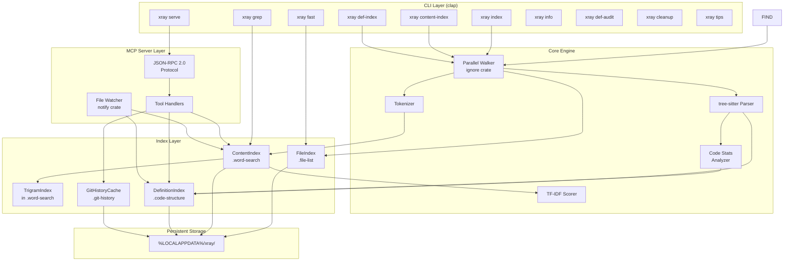
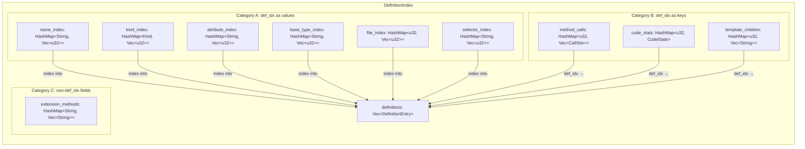
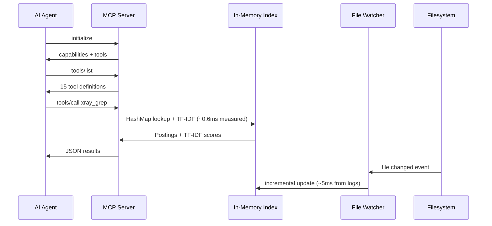
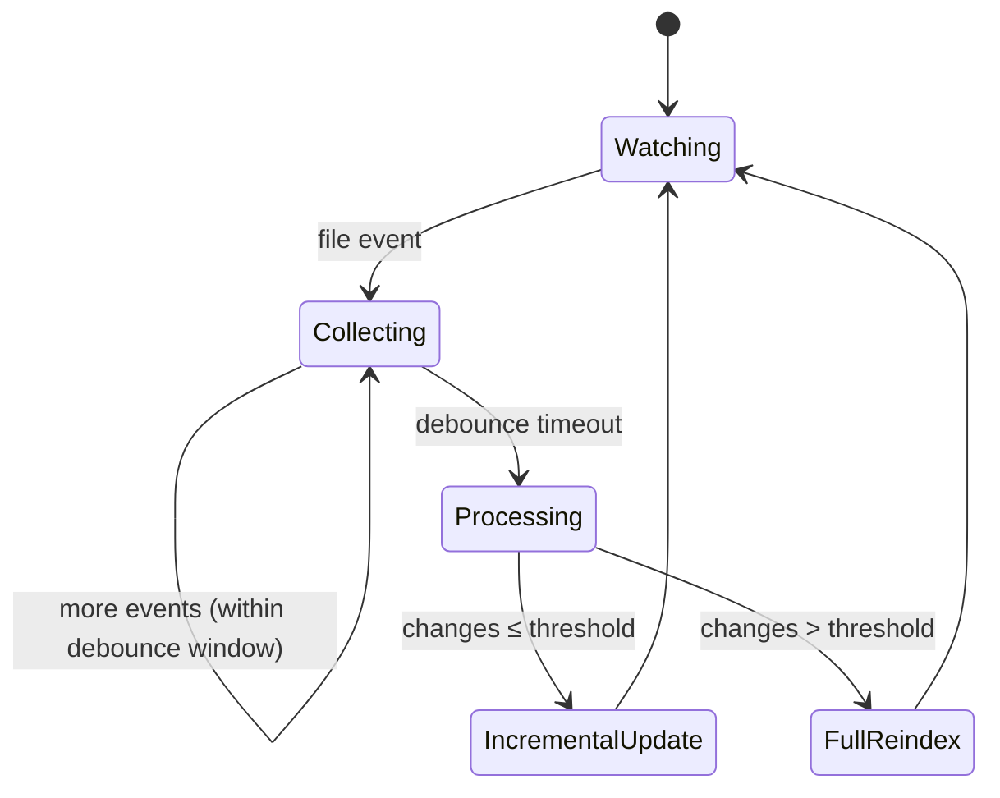
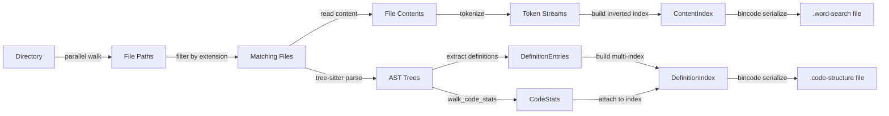
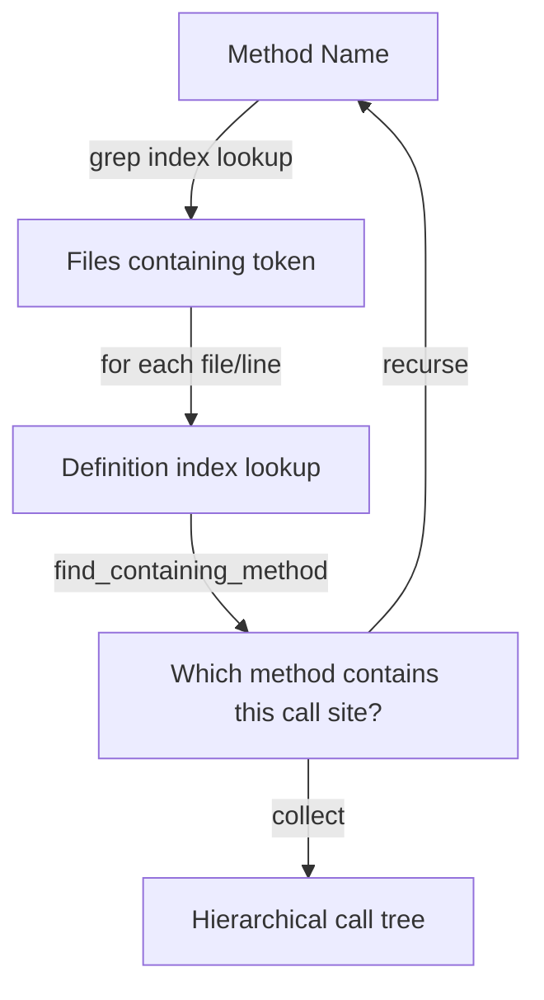
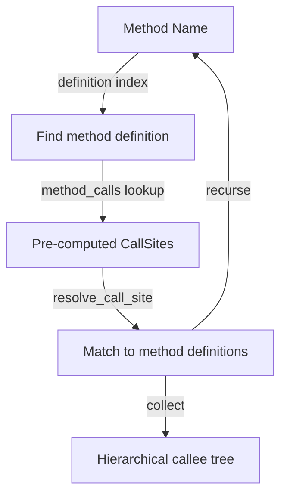

# Architecture

> High-performance code search engine with inverted indexing, AST-based definition extraction, and an MCP server for AI agent integration.

## System Overview



## Component Architecture

### 1. Index Layer

Three independent index types plus a git history cache, each optimized for a different query pattern:

| Index             | File    | Data Structure                  | Lookup                  | Purpose                  |
| ----------------- | ------- | ------------------------------- | ----------------------- | ------------------------ |
| `FileIndex`       | `.file-list`  | `Vec<FileEntry>`                | O(n) in-memory scan (~35ms / 100K files) | File name search         |
| `ContentIndex`    | `.word-search` | `HashMap<String, Vec<Posting>>` + `TrigramIndex` | O(1) per token, O(1) substring via trigrams | Full-text content search + substring search |
| `DefinitionIndex` | `.code-structure` | Multi-index `HashMap` set       | O(1) per name/kind/attr | Structural code search   |
| `GitHistoryCache` | `.git-history` | `HashMap<String, Vec<u32>>` + commit/author pools | O(1) per file path | Git history queries (sub-millisecond) |

All indexes are:

- **Serialized with bincode** — fast binary format, zero-copy deserialization
- **LZ4 frame-compressed on disk** — all index files (`.file-list`, `.word-search`, `.code-structure`) are wrapped in LZ4 frame compression via the `lz4_flex` crate (`FrameEncoder`/`FrameDecoder`). Files start with a 4-byte `LZ4S` magic header for format identification. Compression is streaming (no intermediate full buffer in memory). Typical compression ratio is ~4–5× (e.g., 697 MB → ~150 MB for content indexes). Legacy uncompressed files are still supported — auto-detected on load by checking the magic header for backward compatibility.
- **Stored deterministically** — file path is `hash(canonical_dir [+ extensions])` as hex
- **Self-describing** — each index embeds its root directory, creation timestamp, and staleness threshold
- **Independent** — can be built, loaded, or deleted without affecting other indexes

### 2. Content Index (Inverted Index)

The core data structure. Maps every token to the files and line numbers where it appears. **Language-agnostic** — the tokenizer splits on non-alphanumeric boundaries and lowercases, requiring no language grammar. Works with any text file.

```
Forward view (conceptual):
  file_0.cs → [using, system, class, httpclient, getasync]
  file_1.cs → [namespace, test, httpclient, postasync]

Inverted view (actual storage):
  "httpclient" → [Posting{file_id:0, lines:[5,12]}, Posting{file_id:1, lines:[3]}]
  "getasync"   → [Posting{file_id:0, lines:[15]}]
```

**Key properties:**

- Token lookup is a single `HashMap::get()` — O(1)
- Each `Posting` stores both `file_id` and `lines` — enables line-level results without file I/O
- File paths stored in a separate `Vec<String>` indexed by `file_id` — deduplication
- `file_token_counts[file_id]` stores per-file token count for TF normalization

**Watch-mode fields:**

- `path_to_id: Option<HashMap<PathBuf, u32>>` — path-based file lookup for watcher events (populated only with `--watch`)

**Error tracking fields:**

- `read_errors: usize` — number of files that failed to read during indexing (IO errors)
- `lossy_file_count: usize` — number of files that required lossy UTF-8 conversion

### 3. Definition Index (AST Index)

**Language-specific** structural code search using tree-sitter AST parsing (C#, TypeScript/TSX, Rust) and regex parsing (SQL). Ten cross-referencing indexes over the same `Vec<DefinitionEntry>`, plus pre-computed call graphs and code complexity metrics:



Each `DefinitionEntry` contains: `name`, `kind`, `file_id`, `line_start..line_end`, `parent` (containing class), `signature`, `modifiers`, `attributes`, `base_types`.

Each `CallSite` contains: `method_name`, `receiver_type` (resolved via field/constructor type declarations, DI-aware), `line`.

**Secondary indexes (Category A)** — store `Vec<u32>` where each `u32` is a def_idx into `definitions`:

| Index | Key | Purpose |
|-------|-----|---------|
| `name_index` | lowercased name | Name-based lookup |
| `kind_index` | `DefinitionKind` enum | Filter by class/method/interface/etc. |
| `attribute_index` | lowercased attribute | C# attribute lookup (e.g., `[Test]`, `[ServiceProvider]`) |
| `base_type_index` | lowercased base type | Find implementations of an interface or base class |
| `file_index` | file_id | All definitions in a file — source of truth for active definitions |
| `selector_index` | Angular component selector | Map `<app-user-list>` to the `@Component` class |

**Data indexes (Category B)** — store data keyed by def_idx:

| Index | Value | Purpose |
|-------|-------|---------|
| `method_calls` | `Vec<CallSite>` | Pre-computed call sites for instant callee lookups (direction "down") |
| `code_stats` | `CodeStats` | Cyclomatic/cognitive complexity, nesting, params, returns, calls, lambdas |
| `template_children` | `Vec<String>` | Angular HTML template → child component selectors |

**Auxiliary fields (Category C):**

| Field | Purpose |
|-------|---------|
| `path_to_id` | Path → file_id lookup for watcher incremental updates |
| `extension_methods` | C# extension method name → static class names containing the extension |
| `parse_errors` | Files that failed to read during indexing |
| `lossy_file_count` | Files read with lossy UTF-8 conversion |
| `empty_file_ids` | Files parsed but producing 0 definitions |

The `method_calls` map stores pre-computed call sites for each method/constructor, extracted during `def-index` build by walking AST `invocation_expression` and `member_access_expression` nodes. This enables instant callee lookups (direction "down") without runtime file I/O.

The multi-index design enables compound queries: "find all public async methods in classes that implement `IQueryHandler` and have `[ServiceProvider]` attribute" — resolved via set intersection of index lookups.

### 4. Code Stats (Complexity Metrics)

Each method/constructor/function gets complexity metrics computed during AST parsing via `walk_code_stats()` in `tree_sitter_utils.rs`. The metrics are stored in `DefinitionIndex.code_stats` keyed by def_idx.

```rust
pub struct CodeStats {
    pub cyclomatic_complexity: u16,  // linearly independent paths (base=1)
    pub cognitive_complexity: u16,   // SonarSource cognitive complexity (penalizes nesting)
    pub max_nesting_depth: u8,       // deepest control flow nesting
    pub param_count: u8,             // parameters in signature
    pub return_count: u8,            // return + throw statements
    pub call_count: u16,             // method/function calls (fan-out)
    pub lambda_count: u8,            // lambda/arrow function expressions
}
```

**Language-agnostic walker** — `CodeStatsConfig` struct defines which AST node names correspond to branching, case, return, etc. for each language. Currently configured for C#, TypeScript/TSX, and Rust.

**Query API** (via `xray_definitions`):

- `sortBy` — sort results by any metric descending (e.g., `sortBy='cognitiveComplexity'` for worst methods first)
- `minComplexity`, `minCognitive`, `minNesting`, `minParams`, `minReturns`, `minCalls` — filter thresholds (combine with AND)
- `includeCodeStats` — include metrics in response (auto-enabled by `sortBy`/`min*`)

### 5. Trigram Index (Substring Search)

The trigram index enables fast substring matching within indexed tokens. It solves the compound-identifier problem: when the tokenizer produces a single token like `databaseconnectionfactory`, a search for `DatabaseConnection` would fail with exact token lookup. The trigram index makes this possible in ~0.07ms.

#### Data Structure

```rust
pub struct TrigramIndex {
    /// All unique tokens from the inverted index, sorted alphabetically.
    pub tokens: Vec<String>,
    /// Trigram → sorted vec of token indices (into `tokens` vec).
    pub trigram_map: HashMap<String, Vec<u32>>,
}
```

The `TrigramIndex` is a field of `ContentIndex` (not `Option` — always built):

```rust
pub struct ContentIndex {
    // ... existing fields ...
    pub trigram: TrigramIndex,        // always populated
    pub trigram_dirty: bool,          // lazy rebuild flag for watcher
}
```

#### How It Works

A **trigram** is a 3-character sliding window over a string:

```
Token:    "httpclient"
Trigrams: "htt", "ttp", "tpc", "pcl", "cli", "lie", "ien", "ent"
```

The trigram index maps each trigram to all tokens containing it:

```
"htt" → [httpclient, httphandler, httpcontext, ...]
"cli" → [httpclient, clickhandler, clientbase, ...]
```

**Searching for substring** `"httpcli"`:

1. Generate query trigrams: `"htt"`, `"ttp"`, `"tpc"`, `"pcl"`, `"cli"`
2. Intersect posting lists (sorted merge) — only tokens in ALL lists survive
3. Verify candidates with `token.contains("httpcli")` — filters trigram false positives
4. Look up verified tokens in the main inverted index → file postings + TF-IDF scoring

#### Index Build

The trigram index is built automatically at the end of `build_content_index()` in [`index.rs`](../src/index.rs):


The `dedup` step removes **duplicate token indices that arise from sliding-window overlap within a single token** (e.g. token `"abcabc"` produces trigram `"abc"` twice via the sliding window, so its token-index would be pushed into the `"abc"` posting list twice without dedup). It is **not** dedup of the underlying file-level work — each surviving token-index still resolves to its full posting list of `(file_id, lines)` entries downstream. The benefit is a smaller, sorted posting list that supports cheap intersection during query.

Build time is ~200ms for 754K tokens — negligible compared to the main index build (~7–16s).

#### Memory Overhead

| Component               | Size       |
| ----------------------- | ---------- |
| `tokens: Vec<String>`   | ~11 MB     |
| `trigram_map` values     | ~40 MB     |
| `trigram_map` keys       | ~0.1 MB    |
| HashMap overhead         | ~5 MB      |
| **Total trigram index**  | **~56 MB** |

This is ~23% overhead on top of the 242 MB content index.

#### Watcher Integration (Lazy Rebuild)

Rather than performing complex incremental updates to the trigram index on every file change, the watcher uses a **lazy rebuild strategy**:

1. On file change: watcher updates the main inverted index incrementally (as before) and sets `trigram_dirty = true`.
2. On next substring search: if `trigram_dirty`, the trigram index is rebuilt from scratch and swapped in. Then `trigram_dirty = false`.
3. On bulk reindex (changes > threshold): trigram is rebuilt alongside the main index.

**Locking discipline (`ensure_trigram_index` in [`src/mcp/handlers/grep.rs`](../src/mcp/handlers/grep.rs)):** the rebuild work itself runs under the `ContentIndex` **read lock** — it does **not** block other readers (concurrent `xray_grep` / `xray_callers` queries continue without contention). Only the final pointer swap takes the **write lock**, and a double-checked `trigram_dirty` re-test inside the write critical section guards against duplicate work when two readers race into rebuild. The historical "~200ms write-lock stall on rebuild" no longer applies; the write critical section is microseconds (assignment + flag flip), the rebuild itself is the dominant cost but does not stall readers.

```text
(reader path on a dirty trigram)
  read-lock  → build new TrigramIndex from inverted index (the hot work)
  write-lock → if still dirty: index.trigram = new; trigram_dirty = false (microseconds)
  read-lock  → normal substring query against fresh trigram
```

This keeps the watcher fast (no O(n) index shifting) and keeps reader latency bounded even when a rebuild is in flight.

### 6. Git History Cache

Background-built compact in-memory cache for sub-millisecond git history queries. Replaces 2–6 sec CLI calls with HashMap lookups when the cache is ready.

```
Arc<RwLock<Option<GitHistoryCache>>>
├── None → cache not ready, fallback to CLI (git log)
└── Some(cache) → sub-millisecond queries
```

**Key properties:**

- **Background build** — spawned in a separate thread on server startup (same pattern as content/definition index). Does not block the event loop.
- **Build-then-swap** — new cache is built in a separate allocation (~59 sec for 50K commits), then swapped in under a write lock in microseconds (pointer swap)
- **CLI fallback** — while the cache is building, all git history queries transparently fall back to CLI `git log` commands (Phase 1 behavior, zero regression)
- **Disk persistence** — saved to `.git-history` file (bincode + LZ4, same format as `.word-search` and `.code-structure`). ~100 ms load on subsequent starts vs ~59 sec rebuild
- **HEAD validation** — on startup, checks if cached HEAD matches current HEAD. If HEAD changed (fast-forward) → rebuild; if force push/rebase → rebuild; if repo re-cloned → rebuild
- **Compact representation** — ~7.6 MB RAM for 50K commits × 65K files:
  - `CommitMeta`: 40 bytes per commit (`[u8;20]` hash, `i64` timestamp, `u16` author index, `u32` subject offset/length)
  - Author pool: deduplicated `(name, email)` pairs
  - Subject pool: concatenated commit subjects
  - `file_commits: HashMap<String, Vec<u32>>` — normalized file path → commit IDs

**Query API:**

| Method | Input | Output | Time |
|---|---|---|---|
| `query_file_history()` | file path, date range, maxResults | Vec of commits | <1 ms |
| `query_authors()` | file/dir path, date range | Vec of authors with commit counts | <1 ms |
| `query_activity()` | dir prefix, date range | Vec of changed files with commits | 1–3 ms |

**What uses the cache:**

| Tool | Cache | CLI fallback | Notes |
|---|---|---|---|
| `xray_git_history` | ✅ | git log -- file | Cache response includes `"(from cache)"` hint |
| `xray_git_authors` | ✅ | git log -- file | Aggregation by author |
| `xray_git_activity` | ✅ | git log --name-only | Path prefix matching |
| `xray_git_diff` | ❌ Always CLI | git diff | Diff data too large to cache |
| `xray_git_blame` | ❌ Always CLI | git blame | Blame data not cached |
| `xray_branch_status` | ❌ Always CLI | git status / rev-list | Branch metadata, not file-specific |

**Module:** [`src/git/cache.rs`](../src/git/cache.rs) — self-contained, zero imports from `index.rs`, `definitions/`, or `mcp/`. Depends only on `std`, `serde`, `bincode`, `lz4_flex`.

### 7. MCP Server

JSON-RPC 2.0 event loop over stdio. Designed for AI agent integration (VS Code Copilot, Roo, Claude).



**MCP Tools (15 total):**

| # | Tool | Index/Source | Purpose |
|---|------|-------------|---------|
| 1 | `xray_grep` | ContentIndex | Full-text search with TF-IDF, substring, phrase, regex |
| 2 | `xray_fast` | FileIndex | Pre-built file name search (~35ms) |
| 3 | `xray_definitions` | DefinitionIndex | Structural code search (classes, methods, etc.) |
| 4 | `xray_callers` | DefinitionIndex + ContentIndex | Call tree analysis (up/down), DI-aware |
| 5 | `xray_edit` | Filesystem | Multi-file atomic edits (line-range or text-match), auto-creates files |
| 6 | `xray_info` | All | Index status, sizes, age |
| 7 | `xray_help` | — | Best practices guide for LLM agents |
| 8 | `xray_reindex` | ContentIndex | Force rebuild content index |
| 9 | `xray_reindex_definitions` | DefinitionIndex | Force rebuild definition index |
| 10 | `xray_git_history` | GitHistoryCache / CLI | Commit history for a file |
| 11 | `xray_git_diff` | CLI only | Commit history with full diff/patch |
| 12 | `xray_git_authors` | GitHistoryCache / CLI | Top contributors for file/directory |
| 13 | `xray_git_activity` | GitHistoryCache / CLI | All changed files in a date range |
| 14 | `xray_git_blame` | CLI only | Per-line author/date/commit |
| 15 | `xray_branch_status` | CLI only | Current branch, ahead/behind, dirty files, fetch age |

**Design decisions:**

- **Stdio transport** — no HTTP overhead, direct pipe from VS Code process manager
- **Async startup** — event loop starts immediately with empty indexes; pre-built indexes load synchronously from disk (< 3s), otherwise build in background threads. `AtomicBool` flags (`content_ready`, `def_ready`) gate search tools — they return "index is building" until ready. `initialize`, `tools/list`, `xray_help`, and `xray_info` work immediately.
- **Single-threaded event loop** — JSON-RPC is sequential; index reads use `RwLock` for watcher concurrency
- **Indexes held in `Arc<RwLock<T>>`** — watcher thread writes, server thread reads; background build thread writes once at completion
- **All logging to stderr** — stdout is exclusively for JSON-RPC protocol messages
- **Response size truncation** — all tool responses are capped at **~16KB (~4K tokens)** to prevent filling LLM context windows. Progressive truncation: cap line arrays → remove lineContent → cap matchedTokens → remove lines → reduce file count. Truncation metadata (`responseTruncated`, `truncationReason`, `hint`) is injected into the summary so the LLM knows to narrow its query.

### 8. File Watcher

OS-level filesystem notifications (via `notify` crate / `ReadDirectoryChangesW` on Windows) with debounced batch processing, backed by a periodic rescan fail-safe.



**Periodic rescan fail-safe.** A separate background thread (`start_periodic_rescan`) ticks every `--rescan-interval-sec` (default 5 min, min 10 s) and walks the workspace to detect drift between disk state and the in-memory `ContentIndex` / `FileIndex`. Drift triggers reconciliation via the same code paths as the live event loop. This bounds the worst-case index staleness when the OS drops events under load (e.g., `git checkout && git pull` overflowing the `ReadDirectoryChangesW` buffer). Counters surfaced in `xray_info["watcher"]["periodicRescanDriftEvents"]`. See [`docs/concurrency.md`](concurrency.md#periodic-rescan-fail-safe-for-missed-events) for the full design.

**Incremental update path** (per file, ~50-100ms):

1. Read file content from disk
2. Remove old postings from inverted index (brute-force scan of all tokens for the file_id — no forward index needed, saves ~1.5 GB RAM)
3. Re-tokenize file
4. Add new tokens to inverted index
5. If definition index is loaded: re-parse with tree-sitter, update definition entries

**Full reindex path** (triggered by large batch of changes):

- Full rebuild of content index from scratch
- Triggered by git checkout, branch switch, large merges

## Data Flow

### Index Build Pipeline



### Query Pipeline


**TF-IDF scoring:**

```
score(term, file) = TF(term, file) × IDF(term)

TF  = occurrences_in_file / total_tokens_in_file
IDF = ln(total_files / files_containing_term)
```

Multi-term: scores are summed across matching terms. Files matching more terms rank higher naturally.

### Relevance Ranking

Results from `xray_definitions`, `xray_fast`, and `xray_grep` (phrase mode) are sorted by relevance using a multi-key tiered sort algorithm. This ensures that exact matches appear first, followed by prefix matches, then substring/contains matches — critical for AI agents that rely on the first 5–10 results.

#### Algorithm: `best_match_tier()`

Shared function in `utils.rs` that classifies a name against search terms (case-insensitive):

| Tier | Match Type | Example (query: `UserService`) |
|------|-----------|-------------------------------|
| 0    | **Exact** — name equals a search term | `UserService` |
| 1    | **Prefix** — name starts with a search term | `UserServiceFactory`, `UserServiceHelper` |
| 2    | **Contains** — name contains a search term | `IUserService`, `BaseUserService` |

For comma-separated multi-term queries, the **best** (lowest) tier across all terms is used.

#### Sort Keys by Tool

**`xray_definitions`** (when `name` filter is active, non-regex):

```
1. Match tier:   exact(0) > prefix(1) > contains(2)
2. Kind:         class/interface/enum/struct/record(0) > method/property/field(1)
3. Name length:  shorter > longer
4. Alphabetical: deterministic tiebreaker
```

**`xray_fast`** (file name search):

```
1. Match tier:   exact(0) > prefix(1) > contains(2)  — by filename stem (no extension)
2. Stem length:  shorter > longer
3. Full path:    alphabetical tiebreaker
```

**`xray_grep` phrase mode**: sorted by occurrence count (descending).

**Not ranked**: `xray_grep` token/substring mode (uses TF-IDF), regex mode in `xray_definitions` (no "exact match" semantics).

#### Design Decisions

- **No numeric score in JSON** — LLM agents use result **order**, not absolute score values. No `relevanceScore` field is emitted.
- **Kind is a tiebreaker, not a primary key** — a method `GetUser` (exact, tier 0) always outranks a class `GetUserService` (prefix, tier 1). Kind only matters within the same tier.
- **Case-insensitive comparison** — `best_match_tier()` lowercases both the name and terms internally, so ranking works correctly regardless of input casing.

See [TODO-relevance-ranking.md](TODO-relevance-ranking.md) for the full design rationale and comparison of alternatives.

### Call Tree Pipeline (xray_callers)

**Direction "up" (find callers):**


**Direction "down" (find callees):**


Direction "up" combines the content index (where does this token appear?) with the definition index (which method spans this line range?). Supports `class` parameter for disambiguation and `resolveInterfaces` for DI-aware tracing. When a `class` filter is specified, file candidates are pre-computed via exact token lookup + **trigram substring matching** (`collect_substring_file_ids`) to handle field naming patterns like `m_orderProcessor`, `_userService` where the class name appears as a substring of a larger token.

Direction "down" uses the pre-computed call graph — zero runtime file I/O. Call sites are extracted during `def-index` build with field type resolution (DI constructor parameter types → field types → receiver types).

**Advanced features:**

- **`includeBody`** — returns source code of each method in the call tree inline, plus a `rootMethod` object with the searched method's own body. Eliminates separate `xray_definitions` calls.
- **`includeDocComments`** — expands body upward to include doc-comments (`///` in C#/Rust, `/** */` JSDoc in TypeScript). Implies `includeBody=true`.
- **`impactAnalysis`** — when `direction='up'`, identifies test methods in the caller chain. Test methods (detected via `[Test]`/`[Fact]`/`[Theory]`/`[TestMethod]`/`#[test]` attributes or `*.spec.ts`/`*.test.ts` file patterns) are marked with `isTest=true` and collected in a `testsCovering` array with full file path, depth, and call chain. Recursion stops at test methods.

#### Caller Tree Verification

The `xray_callers` tool builds call trees by tracing method invocations through AST-parsed call-site data. Key design points:

- **Call-site verification is mandatory** — methods without parsed call-site data are filtered out (no false-positive fallback)
- **Expression body properties supported** — C# expression body properties (`public string Name => _service.GetName();`) have their call sites extracted and verified
- **Lambda / arrow function calls captured** — call sites inside lambdas (C#) and arrow functions (TypeScript) in argument lists are recursively parsed
- **Pre-filter uses class name and method name only** — base types and interfaces are not expanded during the pre-filter phase; inheritance verification happens during call-site validation via receiver type matching
- **`direction=down` cross-class scoping** — when building callee trees, unqualified calls without a receiver type resolve only to methods in the caller's own class (prevents cross-class pollution at depth ≥ 2)
- **Generic arity mismatch filter** — `new Foo<T>()` call sites skip non-generic classes with the same name (e.g., `new List<CatalogEntry>()` won't resolve to a non-generic `List` class)
- **Built-in type blocklist** — 60+ built-in receiver types (Promise, Array, Map, String, Object, etc.) are excluded from `direction=down` resolution, preventing false positives like `Promise.resolve()` matching `Deferred.resolve()`
- **Fuzzy DI interface matching** — finds callers through non-standard interface naming conventions (e.g., `IDataModelService` → `DataModelWebService`) using suffix-tolerant matching against the `base_type_index`
- **Type inference for local variables** — cast expressions (`(Type)expr`), `as` expressions (`expr as Type`), method return types (`var x = GetStream()`), `await`/`Task<T>` unwrap (`var x = await GetStreamAsync()`), pattern matching (`if (obj is Type name)`, `case Type name:`), and extension method detection. Cross-class method return types are NOT resolved (only same-class methods)
- **Local variable limitation** — calls through local variables (e.g., `var x = service.GetFoo(); x.Bar()`) may not be detected when the return type cannot be inferred. DI-injected fields, `this`/`base` calls, and direct receiver calls are fully supported

#### Angular Template Metadata

Angular `@Component` class definitions are automatically enriched with template metadata during definition indexing:

- **What it does** — extracts `selector` and `templateUrl` from the `@Component()` decorator, reads the paired `.html` file, and scans for custom elements (tags with hyphens) used in the template
- **`xray_definitions`** — Angular components include `selector` (e.g., `"app-user-profile"`) and `templateChildren` (list of child component selectors found in the HTML)
- **Component tree navigation via `xray_callers`**:
  - `direction='down'` with a component class name → shows child components from the HTML template (recursive with `depth`)
  - `direction='up'` with a selector (e.g., `"app-footer"`) → finds parent components that use it in their templates
- **HTML content search** — add `html` to `--ext` / `ext` parameter for `xray_grep` to search HTML template content

**Limitations:** Only external templates (`templateUrl`), not inline `template:`. Only tags with hyphens (custom elements per HTML spec). `ng-*` tags are excluded (Angular built-ins). Template metadata updates on full `def-index` rebuild, not incrementally on `.html` changes.

## Indexing Triggers — When Does Indexing Happen?

A single consolidated reference for all indexing scenarios. For detailed internals, see [Storage Model](storage.md), [Concurrency](concurrency.md), and [CLI Reference](cli-reference.md).

### Full Index Build

| Trigger | What Happens | Indexes Affected | Time |
|---------|-------------|-----------------|------|
| `xray content-index -d DIR -e EXT` | Full parallel walk + tokenization | ContentIndex (`.word-search`) | ~7–16s |
| `xray def-index -d DIR -e EXT` | Full parallel walk + tree-sitter parse | DefinitionIndex (`.code-structure`) | ~16–32s |
| `xray index -d DIR` | Full parallel walk | FileIndex (`.file-list`) | ~2–4s |
| MCP server first start (no index on disk) | Background thread builds indexes; tools return "index is building" until ready | ContentIndex + DefinitionIndex (if `--definitions`) | Same as above |
| `xray_reindex` (MCP tool) | Full rebuild + reload in-memory | ContentIndex | ~7–16s |
| `xray_reindex_definitions` (MCP tool) | Full rebuild + reload in-memory | DefinitionIndex | ~16–32s |

### Incremental Update (Watcher)

| Trigger | What Happens | Indexes Affected | Time |
|---------|-------------|-----------------|------|
| File saved in IDE | Watcher detects change after debounce window (`--debounce-ms`, default 500ms), updates inverted index + re-parses AST | ContentIndex + DefinitionIndex | ~50–100ms per file |
| File created | Same as file save — added to both indexes | ContentIndex + DefinitionIndex | ~50–100ms |
| File deleted | Postings purged from inverted index (brute-force scan); definitions removed from def index | ContentIndex + DefinitionIndex | ~50–100ms |

### Lazy / On-Demand Rebuild

| Trigger | What Happens | Indexes Affected | Time |
|---------|-------------|-----------------|------|
| Substring search after file watcher update | `trigram_dirty` flag → trigram index rebuilt from inverted index on next `xray_grep` with `substring=true`. Build runs under read-lock (does **not** block other readers); only the pointer swap takes the write-lock (microseconds, double-checked). | TrigramIndex (in-memory, part of ContentIndex) | rebuild dominates request latency; concurrent reads unaffected |
| `xray fast` with stale FileIndex | Auto-rebuild if `--auto-reindex true` (default) | FileIndex | ~2–4s |
| `xray grep` with stale ContentIndex | Auto-rebuild if `--auto-reindex true` (default) | ContentIndex | ~7–16s |

### Load From Disk (No Rebuild)

| Trigger | What Happens | Time |
|---------|-------------|------|
| MCP server start (index exists on disk) | Synchronous load of LZ4-compressed bincode files | < 3s |
| `xray grep` / `xray fast` (index exists, not stale) | Load from disk | < 3s |

### What Does NOT Trigger Re-indexing

| Scenario | Why |
|----------|-----|
| Upgrading `xray.exe` binary (runtime logic changes only) | Index format unchanged → existing `.word-search` / `.code-structure` files are fully compatible |
| Upgrading `xray.exe` binary (parser changes — new definition types, new call site patterns) | Old index loads fine but may have stale/incomplete data → **manual `xray_reindex_definitions`** recommended |
| Upgrading `xray.exe` binary (index format changes — e.g., new field added to struct) | Bincode deserialization fails → index is rebuilt automatically on next server start |
| Restarting VS Code / MCP server | Index loads from disk (if saved); no rebuild |
| Opening a different VS Code workspace | Each workspace has its own MCP server instance with its own index |

### Graceful Shutdown — Saving Incremental Changes

When the MCP server shuts down (stdin closes), it saves both in-memory indexes to disk. This preserves all incremental watcher updates that were only held in memory. On next startup, the saved indexes are loaded — no rebuild needed for changes made during the previous session.

## Module Structure

```
src/
├── lib.rs                    # Public types: FileEntry, FileIndex, ContentIndex, Posting
│                               tokenize(), clean_path() — shared by binary and benchmarks
├── lib_tests.rs              # Unit tests for tokenizer, clean_path, indexing
├── lib_property_tests.rs     # Property-based tests (proptest)
├── main.rs                   # Entry point (~30 lines): mod declarations, re-exports, fn main()
├── main_tests.rs             # Integration tests for CLI commands
├── index.rs                  # Index storage: save/load/build for FileIndex and ContentIndex
│                               index_dir(), *_path_for(), build_index(), build_content_index()
├── index_tests.rs            # Unit tests for index build/load/save
├── error.rs                  # SearchError enum (thiserror) — unified error type
├── error_tests.rs            # Error handling tests
├── tips.rs                   # Best-practices guide text for xray_help / CLI tips
├── tips_tests.rs             # Tests for tips content and tool definition token budget
│
├── git/                      # Git history: CLI tools + in-memory cache
│   ├── mod.rs                # Phase 1 CLI functions (file_history, top_authors, repo_activity)
│   ├── cache.rs              # GitHistoryCache: compact struct, streaming parser, query API,
│   │                           disk persistence (save_to_disk/load_from_disk), HEAD validation
│   ├── cache_tests.rs        # Unit tests (parser, queries, normalization, serialization)
│   └── git_tests.rs          # Git CLI integration tests
│
├── cli/                      # CLI layer: argument parsing + command implementations
│   ├── mod.rs                # Cli struct, Commands enum, cmd_find/fast/grep dispatch
│   ├── args.rs               # All Args structs (FindArgs, IndexArgs, ContentIndexArgs, etc.)
│   ├── info.rs               # cmd_info, cmd_info_json, cmd_cleanup, cmd_def_audit
│   ├── serve.rs              # cmd_serve — MCP server setup and launch
│   ├── cli_tests.rs          # CLI command tests
│   └── info_tests.rs         # Info/cleanup command tests
│
├── definitions/              # AST-based code definition index (tree-sitter + regex)
│   ├── mod.rs                # build_definition_index() + re-exports
│   ├── types.rs              # DefinitionKind, DefinitionEntry, DefinitionIndex, CallSite, CodeStats
│   ├── tree_sitter_utils.rs  # Shared tree-sitter helpers: node_text, find_child_by_kind,
│   │                           walk_code_stats (complexity metrics), CodeStatsConfig
│   ├── parser_csharp.rs      # C# AST parsing: walk/extract functions (~30 helpers)
│   ├── parser_typescript.rs  # TypeScript/TSX AST parsing (classes, functions, interfaces, etc.)
│   ├── parser_rust.rs        # Rust AST parsing (structs, enums, traits, impl blocks, functions)
│   ├── parser_sql.rs         # SQL DDL parsing (regex-based: stored procs, tables, views, etc.)
│   ├── storage.rs            # save/load/find definition index + def_index_path_for()
│   ├── incremental.rs        # update_file_definitions, remove_file_definitions
│   ├── definitions_tests.rs  # General definition tests
│   ├── definitions_tests_csharp.rs   # C# parser tests
│   ├── definitions_tests_typescript.rs # TypeScript parser tests
│   ├── definitions_tests_rust.rs     # Rust parser tests
│   ├── definitions_tests_sql.rs      # SQL parser tests
│   ├── audit_tests.rs        # Definition index audit/coverage tests
│   ├── storage_tests.rs      # Storage serialization tests
│   └── tree_sitter_utils_tests.rs    # Tree-sitter utility + CodeStats tests
│
└── mcp/                      # MCP server layer
    ├── mod.rs                # Module exports
    ├── protocol.rs           # JSON-RPC 2.0 types (request, response, error)
    ├── protocol_tests.rs     # Protocol serialization tests
    ├── server.rs             # Stdio event loop, method dispatch, graceful shutdown
    ├── server_tests.rs       # Server lifecycle tests
    ├── watcher.rs            # File watcher, incremental index updates
    ├── watcher_tests.rs      # Watcher integration tests
    └── handlers/             # Tool implementations (one file per tool group)
        ├── mod.rs            # tool_definitions() + dispatch_tool() + reindex handlers
        ├── grep.rs           # handle_xray_grep + phrase/substring helpers
        ├── fast.rs           # handle_xray_fast
        ├── definitions.rs    # handle_xray_definitions + body/doccomment injection + audit
        ├── callers.rs        # handle_xray_callers + caller/callee tree builders + impactAnalysis
        ├── git.rs            # Git history MCP handlers (history/diff/authors/activity/blame/branch_status)
        ├── utils.rs          # validate_search_dir, sorted_intersect, metrics helpers,
        │                       response size truncation, body injection utilities
        ├── handlers_test_utils.rs    # Shared test infrastructure (mock contexts, helpers)
        ├── handlers_tests.rs         # General handler tests
        ├── handlers_tests_csharp.rs  # C# handler tests
        ├── handlers_tests_csharp_callers.rs # C# caller analysis tests
        ├── handlers_tests_typescript.rs     # TypeScript handler tests
        ├── handlers_tests_rust.rs    # Rust handler tests
        ├── handlers_tests_fast.rs    # File search handler tests
        ├── handlers_tests_grep.rs    # Grep handler tests
        ├── handlers_tests_git.rs     # Git handler tests
        ├── handlers_tests_misc.rs    # Miscellaneous handler tests
        ├── grep_tests.rs            # Grep-specific unit tests
        ├── grep_tests_additional.rs  # Additional grep tests
        ├── callers_tests.rs         # Callers-specific unit tests
        ├── callers_tests_additional.rs # Additional callers tests
        ├── definitions_tests.rs     # Definitions handler unit tests
        ├── git_handler_tests.rs     # Git handler unit tests
        └── utils_tests.rs          # Utils/truncation unit tests
```

**Dependency direction:** `cli/*` → `index.rs` → `lib.rs` (types). `mcp/*` → `index.rs` + `definitions/*`. No circular dependencies. MCP layer depends on core index types but core has no knowledge of MCP. `main.rs` delegates to `cli::run()`.

## Language Support

The engine has two layers with **different language coverage**:

| Layer | Tools | Language Support | How it works |
| ----- | ----- | ---------------- | ------------ |
| **Content search** | `xray grep`, `content-index`, `xray_grep` (MCP) | **Any text file** — language-agnostic | Splits text on non-alphanumeric boundaries, lowercases tokens, builds an inverted index. No language grammar needed. Works equally well with C#, Rust, Python, JS/TS, XML, JSON, Markdown, config files, etc. |
| **AST / structural search** | `xray def-index`, `xray_definitions`, `xray_callers` (MCP) | **C#, TypeScript/TSX, and Rust** (tree-sitter), **SQL** (regex) | Uses tree-sitter to parse source into an AST, extracts classes, methods, interfaces, call sites. SQL uses a regex-based parser. Each language parser is optional via Cargo features (`lang-csharp`, `lang-typescript`, `lang-sql`, `lang-rust`). |

### AST Parser Status

| Language          | Parser                       | Definition Types                                                                                           | Status |
| ----------------- | ---------------------------- | ---------------------------------------------------------------------------------------------------------- | ------ |
| C# (.cs)          | tree-sitter-c-sharp          | class, interface, struct, enum, record, method, constructor, property, field, delegate, event, enum member | ✅ Active |
| TypeScript (.ts)  | tree-sitter-typescript       | class, interface, enum, method, constructor, property, field, function, type alias, variable (exported), enum member | ✅ Active |
| TSX (.tsx)         | tree-sitter-typescript (TSX) | *(same as TypeScript)*                                                                                     | ✅ Active |
| SQL (.sql)        | regex-based (no tree-sitter) | stored procedure, table, view, function, user-defined type, column, index                                  | ✅ Active |
| Rust (.rs)        | tree-sitter-rust             | struct, enum, trait (→Interface), method (impl block), constructor (new/default), function, field, enum variant, const/static (→Variable), type alias | ✅ Active (optional: `--features lang-rust`) |

> **Key takeaway:** You can use `content-index` / `xray_grep` on **any** codebase regardless of language. Only `def-index` / `xray_definitions` / `xray_callers` require a supported parser (currently C#, TypeScript/TSX, Rust via tree-sitter; SQL via regex). Each parser is an optional Cargo feature — build with `--no-default-features --features lang-csharp` for C#-only, `--features lang-rust` for Rust, etc.


## Shutdown Semantics and Ctrl+C Handling

**MINOR-15 documentation.**

The MCP server is a stdio-based daemon: it reads newline-framed JSON-RPC
requests from `stdin` in a blocking `BufReader::read_line()` loop on the
main thread. Graceful shutdown is triggered by **EOF on stdin** — i.e.,
the MCP client closing its write end of the pipe. On shutdown, the server
flushes both `ContentIndex` and `DefinitionIndex` to disk so that
incremental watcher updates survive the next launch.

### Known limitation — `Ctrl+C` inside a terminal session

If `xray serve` is launched manually in a terminal (not as a child
process of an MCP client) and the operator presses `Ctrl+C`, the
terminating `SIGINT` / Windows console control event reaches the
process **while the main thread is parked inside the blocking
`read_line()` syscall**. Rust's default `Ctrl+C` handler simply aborts
the process; the shutdown path that writes the in-memory incremental
index updates to disk is skipped. Concretely:

- Any file events that have been tokenized/applied since the last full
  index rebuild but have NOT yet been persisted via the debounced
  watcher save are lost. On next start the indexes are reloaded from
  the on-disk snapshot, so the loss is equivalent to ~1 debounce
  window (default 500 ms) of file changes.
- Search correctness is not affected — the watcher will re-apply
  those events on the next startup because the FS `mtime`s are still
  newer than the index `mtime`.

### Recommended operator workflow

- **Preferred:** close `stdin` (e.g., `Ctrl+D` on Unix, `Ctrl+Z<Enter>`
  on Windows cmd) to trigger the full graceful shutdown path.
- **From an MCP client:** closing the client (VS Code, Claude Desktop,
  etc.) closes the pipe automatically — no operator action needed.
- **Inside a CI script:** send `SIGTERM` only after closing the child
  process's stdin pipe; on Windows, send
  `GenerateConsoleCtrlEvent(CTRL_BREAK_EVENT, 0)` only as a last
  resort.

### Why we don't install a custom `Ctrl+C` handler

A custom handler would need to inject a "shutdown" message into the
blocking `read_line()` loop. On Unix this would require swapping to
`poll()`-based stdin reads; on Windows the equivalent is
`WaitForMultipleObjects` on the stdin handle plus a signal event.
Both approaches add platform-specific complexity and a non-trivial
test surface for a behaviour (operator-initiated `Ctrl+C` on a
manually launched serve) that is explicitly out of the supported
deployment mode (MCP client → child process over pipes). The stdin-close
workaround above covers 100% of production usage.

