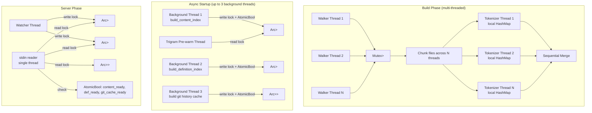
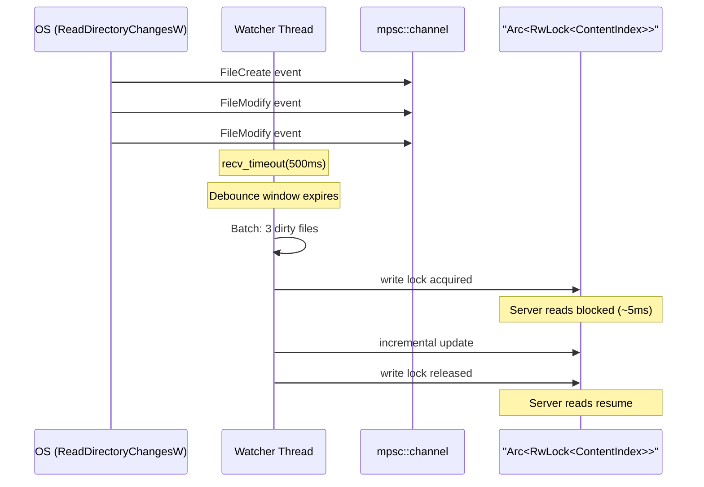

# Concurrency Model

## Overview

The system uses four distinct concurrency strategies depending on the operation phase:

| Phase           | Strategy                                     | Primitives                                            | Why                                                |
| --------------- | -------------------------------------------- | ----------------------------------------------------- | -------------------------------------------------- |
| Index build     | Thread pool (parallel walk + parallel parse) | `WalkBuilder::build_parallel()`, `std::thread::scope` | CPU-bound, embarrassingly parallel                 |
| Async startup   | Background thread(s) + atomic flags          | `std::thread::spawn`, `Arc<AtomicBool>`               | Event loop starts immediately, no client timeout   |
| MCP server      | Single-threaded event loop                   | Sequential stdin line reads, bounded `.take()`        | JSON-RPC is inherently sequential                  |
| File watcher    | Dedicated OS thread + shared state           | `Arc<RwLock<T>>`, `mpsc::channel`                     | Must not block the event loop                      |



## Phase 1: Parallel Index Build

### File Walk (ignore crate)

The `ignore` crate (from ripgrep) provides `WalkBuilder::build_parallel()` which spawns N threads, each walking a subtree of the directory. Results are collected via a `Mutex<Vec<T>>`:

```rust
let file_data: Mutex<Vec<(String, String)>> = Mutex::new(Vec::new());

builder.build_parallel().run(|| {
    Box::new(move |result| {
        // Each thread pushes to shared vec
        file_data.lock().unwrap().push((path, content));
        ignore::WalkState::Continue
    })
});
```

**Lock contention:** Minimal. Each thread holds the mutex only for ~100ns (one `Vec::push`). With 24 threads and ~49K files, the mutex is acquired ~2K times per thread. The `ignore` crate's internal work distribution ensures threads process different directory subtrees, so lock acquisitions are spread over time.

### Content Index Build

Both file walk and tokenization are parallelized. After the parallel walk collects `Vec<(path, content)>`, the files are chunked and tokenized in parallel using `std::thread::scope`:

```
[Parallel Walk] → Vec<(path, content)> → [Parallel Tokenize: chunk files across N threads]
                                           → per-thread local HashMap
                                           → [Sequential Merge: combine local indexes]
```

```rust
let num_tok_threads = thread_count.max(1);
let tok_chunk_size = file_count.div_ceil(num_tok_threads).max(1);

let chunk_results: Vec<_> = std::thread::scope(|s| {
    let handles: Vec<_> = file_data.chunks(tok_chunk_size)
        .enumerate()
        .map(|(chunk_idx, chunk)| {
            let base_file_id = (chunk_idx * tok_chunk_size) as u32;
            s.spawn(move || {
                let mut local_index: HashMap<String, Vec<Posting>> = HashMap::new();
                // tokenize each file in chunk into local_index
            })
        }).collect();
    handles.into_iter().map(|h| h.join().unwrap()).collect()
});

// Sequential merge: ~50ms for 57M tokens
for (local_files, local_counts, local_index, local_total) in chunk_results {
    for (token, postings) in local_index {
        index.entry(token).or_default().extend(postings);
    }
}
```

**Design:** Each thread builds a completely independent local `HashMap<String, Vec<Posting>>` — no shared mutable state, no locks during tokenization. The merge step is sequential but fast (~50ms) because it only moves pre-built `Vec<Posting>` entries. Memory overhead is bounded: each thread's local index is a subset of the global index, and the merge transfers ownership rather than cloning.

**Benchmark (65K files, 57M tokens, 24-core CPU):** Parallel tokenization reduced content index build from 44s to 22s (2× speedup). The merge step is <1% of total time.

### Definition Index Build

Definition parsing IS parallelized because tree-sitter parsing is CPU-intensive (~16-32s for ~48K files depending on CPU):

```rust
let chunks: Vec<Vec<(u32, String)>> = files.chunks(chunk_size).collect();

std::thread::scope(|s| {
    for chunk in chunks {
        s.spawn(move || {
            let mut cs_parser = tree_sitter::Parser::new();
            // TS/TSX/Rust parsers are lazy-initialized only when needed
            let mut ts_parser: Option<Parser> = None;
            let mut tsx_parser: Option<Parser> = None;
            let mut rs_parser: Option<Parser> = None;

            for (file_id, path) in chunk {
                match extension {
                    "cs" => parse_csharp(&mut cs_parser, ...),
                    "ts" => {
                        let p = ts_parser.get_or_insert_with(|| make_ts_parser());
                        parse_typescript(p, ...);
                    }
                    "tsx" => {
                        let p = tsx_parser.get_or_insert_with(|| make_tsx_parser());
                        parse_typescript(p, ...);
                    }
                    "rs" => {
                        let p = rs_parser.get_or_insert_with(|| make_rs_parser());
                        parse_rust(p, ...);
                    }
                    "sql" => parse_sql_regex(...), // regex-based, no tree-sitter
                }
            }
        });
    }
});
// Merge: sequential, ~50ms for ~846K definitions + ~2.4M call sites
```

**Key details:**

- tree-sitter `Parser` is `!Send` (contains internal mutable state). Each thread creates its own parser instance. This is intentional — tree-sitter parsers reuse internal memory allocations across parse calls, making per-thread parsers more efficient than a shared pool.
- **Lazy parser initialization:** TS/TSX/Rust parsers are created via `Option<Parser>` + `get_or_insert_with()` only when a thread encounters a file with that extension. For C#-only projects (the common case), TypeScript/Rust grammars are never loaded, saving ~2s per parser per thread. The `def_exts` parameter in `serve.rs` filters to the intersection of `--ext` and supported languages (`cs`, `ts`, `tsx`, `sql`, `rs`), so unnecessary grammars are never even considered. SQL files use a regex-based parser (no tree-sitter grammar needed).
- **Feature-gated parsers:** Each language parser is behind a Cargo feature flag (`lang-csharp`, `lang-typescript`, `lang-sql`, `lang-rust`). The `definition_extensions()` function returns only the languages enabled at compile time. Missing parsers emit a warning at startup.

## Phase 2: MCP Server Event Loop

The server uses a deliberately simple single-threaded model with bounded reads and graceful shutdown:

```rust
let shutdown_flag = Arc::new(AtomicBool::new(false));
ctrlc::set_handler(move || {
    shutdown_flag.store(true, Ordering::SeqCst);
});

for line in stdin.lock().take(MAX_REQUEST_SIZE).lines() {
    if shutdown_flag.load(Ordering::SeqCst) { break; }
    let request: JsonRpcRequest = serde_json::from_str(&line)?;
    let response = handle_request(&ctx, &request.method, &request.params, id);
    writeln!(stdout, "{}", serde_json::to_string(&response)?);
}

// On exit (EOF or Ctrl+C): save indexes to disk
save_indexes_on_shutdown(&ctx);
```

**Why not async/tokio?**

- MCP over stdio is inherently sequential — one request at a time on stdin
- Each query takes ~0.6ms (HashMap lookup + TF-IDF scoring, measured) — async overhead would exceed query time
- No I/O multiplexing needed — single input source (stdin), single output (stdout)
- Adding tokio would increase binary size and compile time significantly

**Bounded reads:** Each stdin read is capped at 10 MB via `.take(MAX_REQUEST_SIZE)` to prevent OOM from a malicious/buggy client sending gigabytes without a newline.

**Graceful shutdown:** On EOF or Ctrl+C/SIGTERM, the server saves both content and definition indexes to disk via `save_indexes_on_shutdown()`. This preserves incremental watcher updates that were only held in memory.

**Read lock acquisition:** Each query acquires a read lock on the index. Multiple concurrent reads are allowed by `RwLock`, but since we're single-threaded, there's never actual read-read contention. The lock exists to synchronize with the watcher thread and the background build thread (during async startup).

## Phase 2.5: Async Startup (Background Index Build)

When no pre-built index exists on disk (first run), the server spawns background threads to build indexes without blocking the event loop:

```
cmd_serve()
  ├── empty ContentIndex in Arc<RwLock>
  ├── empty DefinitionIndex in Arc<RwLock>
  ├── content_ready = Arc<AtomicBool>(false)
  ├── def_ready = Arc<AtomicBool>(false)
  ├── git_cache_ready = Arc<AtomicBool>(false)
  │
  ├── try load content from disk → if found:
  │     swap + set ready flag (synchronous, < 3s)
  │     + spawn trigram pre-warm thread (read lock)
  │   else: std::thread::spawn → build + save + drop + reload + swap + set ready flag
  │
  ├── try load definitions from disk → if found:
  │     swap + set ready flag (synchronous)
  │   else: std::thread::spawn → build + save + drop + reload + swap + set ready flag
  │
  ├── std::thread::spawn → build/load git history cache + set git_cache_ready
  │
  └── run_server() ← starts immediately
        └── dispatch_tool checks AtomicBool before each search tool
```

**Synchronization:**

- `AtomicBool` with `Release`/`Acquire` ordering gates tool readiness — cheap (no lock contention)
- Background thread acquires a single write lock to swap the fully-built index into the `Arc<RwLock>`, then sets the `AtomicBool` flag
- Tools that bypass content readiness: `xray_help`, `xray_info`, `xray_find`, `xray_definitions`, `xray_callers`, git tools
- Tools that require content readiness: `xray_grep`, `xray_fast`, `xray_reindex`
- Tools that require definition readiness: `xray_definitions`, `xray_callers`, `xray_reindex_definitions`
- `xray_reindex` during background build returns "already building" error to prevent double-builds

**Drop-and-reload pattern (memory optimization):**

Background build threads use a build → save → drop → reload pattern to eliminate allocator fragmentation:

```
build_content_index() → save to disk → drop(build result)
  → mimalloc_collect() → load_content_index() from disk → swap into Arc<RwLock>
```

Building creates many temporary allocations that fragment the heap. Reloading from the serialized binary gives compact contiguous memory, saving ~1.5 GB of RAM. The same pattern is used for the definition index.

**Trigram pre-warm:** After the content index is loaded (from disk or background build), a separate thread reads the index under a read lock to build the trigram index eagerly. This eliminates the cold-start penalty on the first substring search query.

## Phase 3: File Watcher

The watcher runs on a dedicated OS thread spawned at server startup:



### Startup Reconciliation

Before entering the event loop, the watcher performs reconciliation to catch files added/modified/removed while the server was offline.

**Definition index** uses lock-free reconciliation (`reconcile_definition_index_nonblocking`):
- Phase 1: Walk filesystem (NO lock) ~3s
- Phase 2: Read lock to determine changed files (~instant)
- Phase 3: Parse all changed files in parallel via `thread::scope` (NO lock) — the slow part
- Phase 4: Write lock to apply results (<500ms)

During Phase 3, MCP queries work normally on old index data — users don't notice reconciliation.

**Content index** still uses synchronous reconciliation under a write lock.

Reconciliation details:

1. Walk the filesystem to collect all matching files with their mtime
2. Compare against the in-memory index (loaded from disk cache):
   - **Added** files: exist on disk but not in `path_to_id` → tokenize and add
   - **Modified** files: exist in both but `mtime > index.created_at - 2s` → re-tokenize
   - **Deleted** files: exist in `path_to_id` but not on disk → remove
3. Both content index and definition index are reconciled independently

This runs synchronously on the watcher thread. File events arriving during reconciliation are buffered in the `mpsc::channel` and processed in the next debounce cycle.

### Debounce Strategy

File events are collected into a `HashSet<PathBuf>` (deduplicating rapid saves of the same file) and processed in batch after the debounce window:

```rust
loop {
    match rx.recv_timeout(Duration::from_millis(debounce_ms)) {
        Ok(event) => {
            if is_inside_git_dir(path) { continue; } // filter .git internals
            dirty_files.insert(path);
        }
        Err(Timeout) => {
            // Process batch via batch_purge + re-tokenize
            if !process_batch(&index, &def_index, &mut dirty_files, &mut removed_files) {
                break; // RwLock poisoned — exit thread
            }
        }
    }
}
```

**`.git` directory filtering:** Events inside `.git/` are silently skipped — git operations generate massive event floods and `.git/config` would match the "config" extension filter.

### Batch Purge (Efficient Multi-File Updates)

When multiple files change at once (git pull, branch switch), the watcher uses `batch_purge_files` to remove stale postings for ALL changed files in a single O(total_postings) pass, instead of N sequential scans:

| Scenario        | Old behavior (sequential)   | New behavior (batch_purge)   |
| --------------- | --------------------------- | ---------------------------- |
| 1 file saved    | ~50-100ms (single purge)    | ~50-100ms (single purge)     |
| 10 files (PR)   | ~500ms (10 scans)           | ~100ms (1 scan + re-tokenize)|
| 300 files (git pull) | ~30s (300 scans)       | ~500ms (1 scan)              |
| 10K files (checkout) | ~120s (10K scans)      | ~500ms (1 scan)              |

After the batch purge, dirty files are re-tokenized individually via `reindex_file_after_purge()`. The trigram index is marked dirty and rebuilt lazily on the next substring search.

### Dual Index Updates

When `--definitions` is enabled, the watcher updates both indexes. Content and definition indexes are updated via separate functions with independent write locks:

```rust
// Content index update
fn update_content_index(index, removed_clean, dirty_clean) -> bool {
    match index.write() {
        Ok(mut idx) => { /* batch_purge + re-tokenize */ }
        Err(e) => { return false; } // poisoned — signal exit
    }
    true
}

// Definition index update
fn update_definition_index(def_index, removed_clean, dirty_clean) -> bool {
    if let Some(def_idx) = def_index {
        match def_idx.write() {
            Ok(mut idx) => { /* remove + re-parse */ }
            Err(e) => { return false; } // poisoned — signal exit
        }
    }
    true
}
```

**Important:** The two indexes are updated sequentially, not atomically. There's a brief window where the content index is updated but the definition index is stale. This is acceptable because:

1. The window is <5ms per file
2. Queries that use both indexes (xray_callers) will see slightly stale definition data, which at worst means a caller might be missing from the tree until the next update cycle
3. True atomicity would require either a single lock for both indexes (reducing read concurrency) or a transaction log (complexity not justified)

## Thread Safety Guarantees

| Data              | Owner                                       | Synchronization                             | Invariant                                                                                |
| ----------------- | ------------------------------------------- | ------------------------------------------- | ---------------------------------------------------------------------------------------- |
| `ContentIndex`    | `Arc<RwLock<ContentIndex>>`                 | Read: server thread, trigram warmup. Write: watcher thread, background build thread (once at startup). | Inverted index + file metadata always consistent within a single write lock acquisition. |
| `DefinitionIndex` | `Arc<RwLock<DefinitionIndex>>`              | Same as ContentIndex.                       | Multi-indexes (name, kind, attr, etc.) always consistent within a single write.          |
| `GitHistoryCache` | `Arc<RwLock<Option<GitHistoryCache>>>`      | Write: background build thread (once). Read: server thread (git tools). | `Option<T>` — `None` until cache is built; git tools fall back to CLI when unavailable. |
| `content_ready`   | `Arc<AtomicBool>`                           | Write: background build thread (once). Read: server thread (every dispatch). | `Ordering::Release` on write, `Ordering::Acquire` on read — guarantees index data is visible. |
| `def_ready`       | `Arc<AtomicBool>`                           | Same as `content_ready`.                    | Same guarantee.                                                                          |
| `git_cache_ready` | `Arc<AtomicBool>`                           | Same as `content_ready`.                    | Same guarantee. Git tools fall back to CLI when false.                                   |
| `current_branch`  | `Option<String>` (owned by `HandlerContext`)| No sharing — read-only after startup.       | Set once in `cmd_serve()`, immutable for the server lifetime.                            |
| stdin/stdout      | MCP server thread (exclusive)               | No sharing.                                 | All JSON-RPC I/O on single thread.                                                       |
| stderr            | Any thread                                  | OS-level line buffering.                    | Log lines may interleave but each `eprintln!` is atomic per line.                        |

## Potential Issues and Mitigations

### RwLock Poisoning

If the watcher thread panics while holding a write lock, the `RwLock` becomes poisoned. The watcher's `process_batch()` function detects poisoning and exits the watcher thread gracefully with an error message (`"RwLock poisoned, watcher thread exiting to avoid infinite error loop"`). The server continues operating with the last good index state but without live file watching. The only recovery is restarting the server.

### Watcher Thread Crash

If the watcher thread panics (e.g., out of memory during reindex), the `_watcher` handle is dropped, which stops the file notifications. The server continues operating with a stale index. Detection: no `[watcher]` log messages after a file change.

### Graceful Shutdown

On EOF (stdin closed) or Ctrl+C/SIGTERM, the server saves both content and definition indexes to disk via `save_indexes_on_shutdown()`. This preserves incremental watcher updates that were only held in memory, so the next server startup can load them without a full rebuild.

### Backpressure

If the server is processing a long query (e.g., `xray_callers` with depth=10), incoming file events queue up in the `mpsc::channel`. The channel is unbounded, so events are never lost. They'll be processed in the next debounce window after the query completes.

### Request Size Limits

Each stdin read is capped at 10 MB via `.take(MAX_REQUEST_SIZE)`. Oversized requests are drained (bounded 8KB reads until newline) and skipped with an error log. This prevents OOM from a malicious or buggy client.
