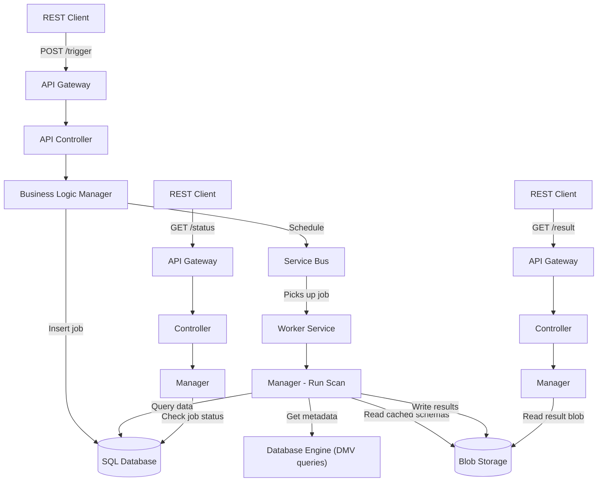

# Use Cases & LLM Workflows


> Numbers measured on a real production codebase — see [benchmarks.md](benchmarks.md). XML is parsed on-demand (`.xml`, `.csproj`, `.props`, `.targets`, `.config`, `.resx`, `.nuspec`, `.appxmanifest`, …) — not bulk-indexed.

Real-world use cases, ready-made LLM workflows, and a case study showing how xray helps GenAI work faster, deeper, and more accurately in large repositories through structural search, code history, call graphs, impact analysis, and safe edits.

---

## Quick Reference: Which Tool Do I Need?

```
DISCOVERY
├── Know the FILE NAME?            → xray_fast              (~25–35ms)
├── Know the CLASS or METHOD?      → xray_definitions       (~1ms)
├── Need a CALL CHAIN?             → xray_callers           (~3–11ms up / 0.5ms down)
├── Need TEXT CONTENT?             → xray_grep              (~1–2ms)
└── Need FILE COUNT only?          → xray_grep countOnly=true (1ms, ~46 tokens)

IMPACT & QUALITY
├── Tests covering a method?       → xray_callers impactAnalysis=true
├── Production callers only?       → xray_callers productionOnly=true
├── Dead code (no callers)?        → xray_definitions includeUsageCount=true
├── Complexity hotspots?           → xray_definitions sortBy=cyclomaticComplexity
└── Implementations of interface?  → xray_definitions baseType=IFoo (+ baseTypeTransitive)

GIT HISTORY
├── Who wrote / when introduced?   → xray_git_blame / xray_git_history
├── When was the file CREATED?     → xray_git_history firstCommit=true
├── What changed this week?        → xray_git_activity from=YYYY-MM-DD
├── What was DELETED from a dir?   → xray_git_activity includeDeleted=true
├── Top contributors?              → xray_git_authors
└── On the right branch?           → xray_branch_status

WRITE & MAINTAIN
├── Edit a file safely?            → xray_edit (atomic, dryRun, multi-file)
├── File line count / size?        → xray_info
├── Force rebuild index?           → xray_reindex / xray_reindex_definitions
└── Not sure?                      → xray_help
```

> Times are pure tool execution time (in-memory index lookup). Add ~1–2 sec of LLM/MCP round-trip latency for end-to-end.

---

## Real-World Use Cases

### 🐛 1. Debugging — Stack Trace Investigation

**Situation:** You receive a production stack trace.

```
NullReferenceException at OrderManager.ProcessOrderAsync(OrderManager.cs:145)
```

<table>
<tr><th>❌ Without xray</th><th>✅ With xray</th></tr>
<tr><td>

```
search_files "ProcessOrderAsync"  → 46s
read_file OrderManager.cs         → 2s
search_files "calls ProcessOrder" → 46s
read_file caller file              → 2s
───────────────────────────────────
Total: ~2 minutes + manual analysis
```

</td><td>

```json
// 1. xray_definitions — find method at line 145 (1ms)
{"file": ["OrderManager.cs"], "containsLine": 145, "includeBody": true}
→ ProcessOrderAsync (lines 120-160), class: OrderManager + body inline

// 2. xray_callers — trace callers AND read bodies in one call (~3-11ms)
{"method": ["ProcessOrderAsync"], "class": "OrderManager",
 "depth": 3, "direction": "up", "includeBody": true}
→ OrderController.CreateOrder (line 56)
    └── OrderManager.ProcessOrderAsync (line 145)
        └── PaymentService.ChargeAsync (line 89)
  + every node carries its source body
───────────────────────────────────
Total: ~3–12 ms (pure tool time)
```

</td></tr>
</table>

**Pure tool speedup: ~10,000–40,000×.** End-to-end (with LLM thinking + MCP round-trip) typically ~10–30× — still the difference between "continue debugging" and "context-switch lost".

---

### 🏗️ 2. Understanding Unfamiliar Code

**Situation:** You need to work on a module you've never seen before.

```json
// Step 1: Map all classes (1ms)
{"name": ["PaymentModule"], "maxResults": 50, "includeBody": false}
→ PaymentService, IPaymentGateway, PaymentValidator, PaymentController...

// Step 2: Trace call chain from API to data layer (~3-11ms)
{"method": ["ProcessPayment"], "class": "PaymentService", "depth": 5, "direction": "down"}
→ PaymentService.ProcessPayment
    ├── PaymentValidator.ValidateRequest
    ├── PaymentGateway.ChargeAsync
    │   └── HttpClient.PostAsync
    └── OrderRepository.UpdateStatusAsync
        └── DbContext.SaveChangesAsync

// Step 3: Find all implementations (1ms)
{"baseType": "IPaymentGateway"}
→ StripeGateway, PayPalGateway, MockPaymentGateway

// Step 4: Assess scale (1ms, 46 tokens)
{"terms": ["PaymentService"], "countOnly": true}
→ 23 files, 47 occurrences
```

**Time saved:** ~40 minutes of manual exploration → **2 minutes**

> See the [Case Study](#case-study-architecture-deep-dive-in-5-minutes) below for a real example.

---

### 📝 3. Code Review — PR Review Assistance

**Situation:** Reviewing a PR — need to understand blast radius.

<table>
<tr><th>❌ Without xray</th><th>✅ With xray</th></tr>
<tr><td>

```
"Who else calls this method?"
rg "UpdateOrder" -t cs    → 46s
read_file                  → 2s
(repeat 3x)                → 3 min

"Which tests will break?"
rg + manual chase          → 5 min

"All implementations?"
rg "IOrderService" -t cs  → 46s

"Feature flag used elsewhere?"
rg "EnableNewPricing"     → 46s
───────────────────
Total: ~10 minutes
```

</td><td>

```json
// xray_callers — production callers + tests covering it, in one call
{"method": ["UpdateOrder"], "class": "OrderService",
 "depth": 3, "impactAnalysis": true, "productionOnly": false}
→ callTree: 3 production callers
→ testsCovering: ["OrderServiceTests.UpdateOrder_HappyPath",
                  "OrderControllerTests.PutOrder_Returns200"]

// xray_definitions — all implementations, transitively (1ms)
{"baseType": "IOrderService", "baseTypeTransitive": true}
→ OrderService, OrderServiceV2, CachingOrderService, MockOrderService

// xray_grep — feature flag everywhere (1ms)
{"terms": ["EnableNewPricing"], "substring": true}
→ 7 files, including .config + code
───────────────────
Total: <15 milliseconds
```

</td></tr>
</table>

---

### 🔄 4. Safe Refactoring

**Situation:** Rename a method — must find ALL usage sites, including compound identifiers.

```json
// Find all mentions including compound names (1ms)
// e.g., DeleteOrderCacheEntry, m_orderService, IOrderService
{"terms": ["OrderService"], "substring": true, "showLines": true, "contextLines": 2}
→ 34 files, 89 occurrences (with surrounding code)

// Confirm all callers (~3-11ms)
{"method": ["ProcessOrder"], "class": "OrderService", "depth": 5}
→ full caller tree

// Find DI registrations (5ms)
{"terms": ["IOrderService","OrderService"], "mode": "and"}
→ 3 files where both appear together
```

**Key advantage:** Substring search catches `DeleteOrderServiceCacheEntry` and `m_orderService` — names that exact-token search misses.

> **Tip:** combine with `xray_callers includeGrepReferences=true` to also catch delegate / method-group / reflection usage that AST doesn't see.

---

### 📊 5. Task Scope Estimation

**Situation:** "How long will this take?"

```json
// How many files? (1ms, ~46 tokens in response)
{"terms": ["FeatureX"], "countOnly": true}
→ 12 files, 31 occurrences

// How complex? (1ms)
{"parent": ["FeatureXManager"], "kind": ["method"]}
→ 14 methods

// How deep? (~3-11ms)
{"method": ["ExecuteFeatureX"], "class": "FeatureXManager", "depth": 5}
→ call tree shows 3 layers deep, touches 2 external services
```

**Result:** In 30 seconds you know: 12 files, 14 methods, 3 layers deep → "2-3 day task."

---

### 🧪 6. Writing Tests

```json
// Read the code under test (1ms)
{"name": ["ProcessOrder"], "parent": ["OrderManager"], "includeBody": true}
→ full method source returned inline

// Discover all dependencies to mock (1ms)
{"parent": ["OrderManager"], "kind": ["field"]}
→ IPaymentService, IOrderRepository, ILogger, IValidator

// Find existing test patterns (35ms)
{"pattern": ["OrderManagerTest"]}
→ tests/OrderManagerTest.cs, tests/OrderManagerIntegrationTest.cs

// Read test examples inline (1ms)
{"file": ["OrderManagerTest.cs"], "kind": ["method"], "includeBody": true}
→ all test methods with source code

// Reverse: which tests already cover this method? (~3-11ms)
// xray_callers impactAnalysis=true walks up and marks test methods
{"method": ["ProcessOrder"], "class": "OrderManager",
 "direction": "up", "impactAnalysis": true, "depth": 5}
→ testsCovering: [{file, depth, callChain}, ...]
```

---

### 🔍 7. Configuration & Dependency Discovery

```json
// All NuGet packages (5ms)
{"terms": ["PackageReference"], "ext": ["csproj"], "showLines": true}

// All feature flags in configs (3ms)
{"terms": ["FeatureFlag"], "ext": ["xml","config","json"]}

// Who depends on my project? (5ms)
{"terms": ["MyProject"], "ext": ["csproj"], "mode": "and"}
```

---

### 🕵️ 8. When Was This Error Introduced?

**Situation:** A new error message `"Entry not found for tenant"` appears in production logs. You need to find exactly when and by whom it was introduced.

```json
// Step 1: Verify you're on the right branch (45ms)
{"repo": "."}
→ branch=main, behindMain=0, fetchAge="2 hours ago" ✓

// Step 2: Find which files contain the text (~1ms)
{"terms": ["Entry not found for tenant"], "phrase": true, "showLines": true}
→ src/Services/EntryService.cs, line 87

// Step 3: Blame the exact lines to find who introduced it (~200ms)
{"repo": ".", "file": ["src/Services/EntryService.cs"], "startLine": 85, "endLine": 90}
→ line 87: commit abc123de by Alice on 2025-01-10

// Step 4: See who maintains the file (< 1ms from cache)
{"repo": ".", "path": "src/Services/EntryService.cs", "top": 3}
→ Alice (42 commits), Bob (17 commits), Carol (5 commits)

// Step 5: Get full commit context (~2s)
{"repo": ".", "file": ["src/Services/EntryService.cs"], "from": "2025-01-09", "to": "2025-01-11"}
→ full diff showing the exact lines added
```

**Tools used:** `xray_branch_status` → `xray_grep` → `xray_git_blame` → `xray_git_authors` → `xray_git_diff`
**Total time:** ~3 seconds. Without xray: ~10 minutes of `git log`, `git blame`, manual searching.

> **Related:** `xray_git_history firstCommit=true` answers "when was this file CREATED?" in one call (works on deleted files via auto `--follow`). `xray_git_activity includeDeleted=true` lists files that disappeared from a directory in a date range.

---

### ✏️ 9. Safe Multi-File Edits

**Situation:** Rename `LegacyName` → `NewName` across 12 files, with rollback safety and zero stale-index window.

```json
// Step 1: dry-run preview — see exact diff before any byte hits disk (1-2ms)
// xray_edit Mode B, multi-file
{
  "paths": ["src/A.cs", "src/B.cs", "src/C.cs", "...12 files"],
  "edits": [
    {"search": "LegacyName", "replace": "NewName",
     "expectedContext": "public class", "skipIfNotFound": true}
  ],
  "dryRun": true
}
→ unified diff per file, no writes

// Step 2: commit (atomic per file: temp + fsync + rename)
{ ...same payload..., "dryRun": false }
→ writeStatus=committed, reindexStatus=completed,
  reindexElapsedMs="0.42", editResults=[{idx:0, matchCount:34}]

// Step 3: verify — index is ALREADY refreshed, no debounce wait
{"terms": ["LegacyName"], "countOnly": true}
→ 0 files, 0 occurrences ✓
```

**Why this is hard with built-in edit tools:**

- `xray_edit` is **atomic per file** (temp + fsync + rename) → a crash mid-write never leaves a half-written file.
- **Synchronous reindex**: `xray_grep` / `xray_definitions` / `xray_callers` see the new content immediately on the next call (no 500ms FS-watcher debounce).
- **`expectedContext`** acts as a per-edit safety net — a stray match in a comment that lacks the `public class` anchor is left alone.
- **Idempotent `insertAfter` / `insertBefore`**: re-running the same payload after a partial success is safe — already-applied edits are detected and skipped.
- Works on **any text file** (not limited to indexed extensions) — `.cs`, `.rs`, `.sql`, `.csproj`, `.json`, `.yaml`, …

---

### 🧹 10. Tech-Debt Detection — Dead Code, God Classes, Hotspots

**Situation:** PR review or quarterly cleanup — find code that quietly rotted.

```json
// Dead code: methods that appear nowhere else (1ms)
// xray_definitions includeUsageCount counts content-index occurrences
{"kind": ["method"], "parent": ["OrderModule"], "includeUsageCount": true}
→ filter usageCount<=1 → 14 candidates for deletion

// God classes: largest files by line count (1ms)
{"kind": ["class"], "sortBy": "lines", "maxResults": 10}
→ top 10 classes by SLOC, ready for split-up

// Complexity hotspots: cyclomatic + cognitive (1ms)
{"sortBy": "cyclomaticComplexity", "minComplexity": 15, "maxResults": 20}
→ 20 methods worth refactoring first

// Unused feature flags: present in config, not in code
{"terms": ["EnableLegacyFlag"], "countOnly": true, "ext": ["cs"]}
→ 0 files → flag is dead, safe to remove
```

**Available metrics (`includeCodeStats=true` or any `sortBy`/`min*`):** `cyclomaticComplexity`, `cognitiveComplexity`, `maxNestingDepth`, `paramCount`, `returnCount`, `callCount`, `lambdaCount`, `lines`.

---

### 📦 11. XML / `.csproj` On-Demand Parsing

**Situation:** `.csproj`, `.config`, `.props`, `.targets`, `.resx`, `.nuspec` files aren't bulk-indexed — they're parsed on demand by `xray_definitions`.

```json
// "Which element contains line 42 of this csproj?" (1ms)
{"file": ["App.csproj"], "containsLine": 42}
→ <PackageReference Include="Newtonsoft.Json" Version="13.0.1"/> (parent ItemGroup)

// Find a config block by leaf TEXT content, not just element name
// Auto-promotes the leaf match to its parent block
{"file": ["service.config"], "name": ["PremiumStorage"]}
→ matched via <ServiceType>PremiumStorage</ServiceType>
  matchedBy="textContent", matchedChild="ServiceType"
  + the surrounding <Service>...</Service> block

// Cross-file: which projects pin a specific package version?
// xray_grep with phrase mode for exact XML attribute
{"terms": ["Version=\"13.0.1\""], "phrase": true, "ext": ["csproj"]}
→ list of csproj files + line numbers
```

Supported XML extensions: `.xml`, `.config`, `.csproj`, `.vbproj`, `.fsproj`, `.vcxproj`, `.nuspec`, `.vsixmanifest`, `.manifestxml`, `.appxmanifest`, `.props`, `.targets`, `.resx`.

---

### ⚡ Time Savings Summary

| Scenario | Without | With | Speedup |
|---|---|---|---|
| Single task (20 searches) | ~17 min | ~0.5 sec | **2,000×** |
| Stack trace (1 frame) | ~5 min | ~15 sec | **20×** |
| Code review (10 questions) | ~8 min | ~0.1 sec | **5,000×** |
| Architecture doc | ~40 min | ~2 min | **20×** |
| Task scope estimation | ~5 min | ~30 sec | **10×** |

**In a typical workday:** 5–10 tasks × 15 min saved = **1–2.5 hours saved daily** per developer.

> Speedup numbers are **pure tool execution time** (in-memory index lookup + JSON response). End-to-end times in real MCP sessions add ~1–2 sec of LLM thinking + MCP round-trip per call — so a 20-call task runs in ~30–60 sec wall time, not ~0.5 sec. The win is still order-of-magnitude, just calibrated against LLM latency rather than disk I/O.

---

## Case Study: Architecture Deep-Dive in 5 Minutes

### Context

We used xray to reverse-engineer a **large async API system** spanning **3,800+ lines** across multiple layers, which we had never seen before.



### What we discovered in ~5 minutes

Using only `xray_definitions`, `xray_callers`, and `xray_grep`:

1. **Found all API endpoints** — identified async 3-step polling: POST trigger → GET status → GET result
2. **Traced the full async job flow**: Controller → Manager → Job Scheduler → Worker Service → blob write
3. **Mapped the core data retrieval** (~400 lines): DB queries, lineage extraction, parallel schema loading
4. **Traced call chains** from controller down to database engine connections
5. **Discovered the caching pipeline**: engine queries → discovery service → blob cache → API reads cache
6. **Identified sub-object support**: only 2 of 7 entity types support detailed metadata
7. **Built complete architecture diagrams** with Mermaid

### Tools used and timing

```json
// Find controller endpoints (1ms)
{"parent": ["ApiController"], "kind": ["method"]}
→ 5 endpoints: PostTrigger, GetStatus, GetResult, GetModified, GetPrerequisites

// Read method bodies (1ms)
{"name": ["PostTrigger"], "parent": ["ApiController"], "includeBody": true}
→ full source: validates input → checks throttling → creates job → schedules → returns 202

// Trace who calls the worker method (~3-11ms)
{"method": ["RunScanAsync"], "class": "Manager", "depth": 3, "direction": "up"}
→ WorkerService.RunScanRequest → Manager.RunScanAsync

// Find all related classes (1ms)
{"name": ["DomainModule"], "kind": ["class"], "maxResults": 50}
→ 41 classes across controller, manager, storage, contracts layers

// Read interface contract (1ms)
{"name": ["IManager"], "kind": ["interface"], "includeBody": true}
→ 7 methods: PostScan, GetStatus, GetResult, GetModified, RunScan, CheckThrottle...

// Trace metadata source (1ms per hop, 3 hops)
Manager.GetSchema → SchemaStorage.GetFromBlob → DB.GetBlobReference
→ discovered: schemas are pre-cached in blob, not queried live
```

**Total search time: <10ms.** The rest was reading and reasoning.

### Key insight

All of this was done **without reading any documentation** — purely by navigating code structure through xray tools. The AST index + call graph + content search, combined with an AI agent's reasoning, turned a multi-day exploration into a 5-minute conversation.

---

## Common LLM Workflows You Can Build Today

These are workflows people often label "future ideas", but every one of them
is doable **right now** by chaining the existing xray MCP tools from inside
a normal LLM agent loop. No extra infrastructure required.

| Workflow | Tool chain | What you get |
|---|---|---|
| **Automatic developer onboarding** | `xray_definitions name=CacheManager` → `xray_callers up depth=3` → `xray_grep terms=["CacheManager"] excludeDir=["test"]` → `xray_definitions parent=CacheManager` | "Where do I start with a CacheManager bug?" answered in ~30 s — class location, callers, key methods, related production code. |
| **PR impact analysis** | `git diff --name-only` → for each changed symbol: `xray_callers method=X depth=5 impactAnalysis=true` | "This change reaches N callers, including these test methods that cover it" — generated as a PR comment. `impactAnalysis=true` is a real, supported flag (`src/mcp/handlers/callers.rs`). |
| **Auto-generated architecture docs** | `xray_definitions file=["src/foo/"]` → `xray_callers direction=down depth=2` per public entry point → LLM emits Mermaid | Generates a class map + call-tree diagram for any subsystem from a single MCP roundtrip set. |
| **Code archaeology** ("tell me the story of this feature") | `xray_definitions name=X` → `xray_git_blame file=… line=…` → `xray_git_history file=…` → `xray_git_diff commit=…` | Narrative of who introduced what and why, anchored to commits — without leaving the chat. |
| **Smart code review** | `xray_grep terms=["BeginScope"] countOnly=true` (find the canonical pattern) → `xray_callers up` on the new method (does it sit under the same wrapper?) | "47 other call sites wrap this in a logging scope — this PR doesn't" detection. |
| **AI migration planner** | `xray_definitions kind=["class"] baseType="IFooService"` → `xray_grep terms=["AddSingleton<IFooService"]` → `xray_callers up depth=3` per implementation | Inventory of all DI registrations + consumers + per-implementation effort estimate. |
| **"Explain this outage"** | Stack trace line → `xray_definitions file=… containsLine=N includeBody=true` → `xray_callers up depth=4` → `xray_grep terms=["FeatureFlag", "Throttle"] excludeDir=["test"]` | Stack trace → method → callers → feature flags / throttling → root-cause summary, all from MCP. |
| **"What if I delete method X" simulator** | `xray_callers method=X depth=N impactAnalysis=true excludeDir=["test"]` (production blast radius) + same call without `excludeDir` (test coverage) | Full blast radius + which tests would catch the regression — already a built-in xray capability via `impactAnalysis`. |

**Why these are doable today, not "future":** every primitive in the chains
above is a stable MCP tool with documented args (see
[mcp-guide.md](mcp-guide.md)). The "novelty" is in the orchestration, which
is exactly what an LLM agent already does for free.

## Future Infrastructure (genuinely not solvable by LLM-orchestration alone)

Things that still require something xray itself does not yet provide:

- **Live architecture map** — interactive UI that streams the existing AST +
  call-graph data into a navigable diagram with co-change heatmaps from git
  history. The data is already in xray; what is missing is a viewer / web
  layer.
- **Cross-repo search** — one query that fans out across multiple
  repositories (frontend → API → backend → DB) at MCP level. Today each
  repo is its own xray workspace; a federated multi-root mode is not yet
  implemented.

---

## Why xray Makes All of This Possible

**AST index + call graph + inverted text index + git history cache + atomic multi-file editor in one tool**, at **sub-millisecond to low single-digit milliseconds per query** across **66K+ files**.

Without it, each scenario requires minutes of ripgrep per query, manual file navigation, or heavyweight tools like Roslyn/CodeQL with long cold starts.

xray provides capabilities that previously required an IDE with a fully-loaded solution — but accessible via MCP in the working flow of an AI agent.
